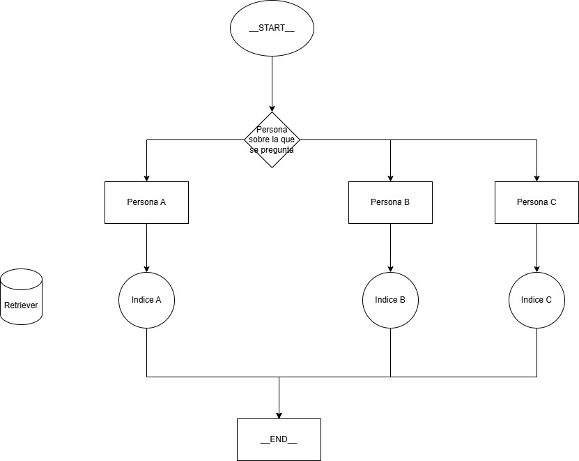

# TP2

## Diagrama de la implementación:

## Video del TP2
https://github.com/user-attachments/assets/f4801a5e-ab65-4114-9c5e-52166334c857

- En el arhivo app.py está el código de la applicación con la que funciona el RAG. Se corre con streamlit
- En el archivo inicial.ipynb está el código con el que generé la base de datos vectorial con los chunks de los CVs
